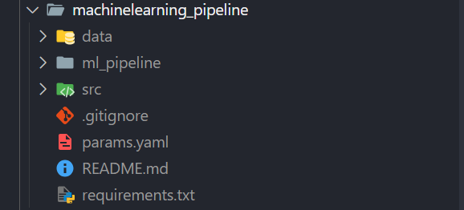

# 🚀 MLOps End-to-End Project with Flask

This repository documents my journey into **Flask** and **MLOps**, starting from scratch and gradually building a production-ready ML system.

---

## 📅 Project Timeline

* **Flask & API Development Start:** May 17, 2025
* **MLflow Integration Start:** September 18, 2025
* **Hyperparameter Optimization with Hyperopt:** May 20, 2025
* **DVC Integration:** May 21, 2025

---

## ✅ Progress Log

### 📌 Flask Fundamentals

* Learned the basics of Flask and its WSGI architecture.
* Built routes and handled requests.
* Used **Jinja2** for rendering dynamic HTML templates.

### 🧩 Jinja2 Templating

* Dynamically injected variables and data into HTML pages.

### 📝 Form Handling

* Developed forms to collect **Name**, **Email**, and **Message**.
* Implemented both **GET** and **POST** methods to handle form submissions.

### 🔗 Variable Routing

* Used `<variable>` in URLs for creating dynamic routes.

### ↺ Redirect with Parameters

* Used `redirect()` and `url_for()` to redirect users and pass parameters cleanly.

### 📊 Marks Entry System

* Built a form to input marks for 3 subjects.
* Calculated average and redirected users to a result page showing `PASS` or `FAIL`.

---

## 🧪 Flask To-Do List API

Developed a simple RESTful API for managing a To-Do list.

### ✅ Features

* View all tasks
* Add new tasks
* Update existing tasks
* Delete tasks

### 🔗 API Endpoints

| Method | Route              | Description        |
| ------ | ------------------ | ------------------ |
| GET    | `/`                | Welcome message    |
| GET    | `/items`           | Retrieve all items |
| POST   | `/items`           | Add a new item     |
| PUT    | `/items/<item_id>` | Update an item     |
| DELETE | `/items/<item_id>` | Delete an item     |

Each item contains:

```json
{
  "id": int,
  "name": str,
  "description": str
}
```

---

## 📈 MLOps with MLflow

### ✅ Initial Setup

* Set up a virtual environment and MLflow project structure.
* Installed MLflow and understood the structure of `mlruns/`.
* Launched the MLflow UI for visual experiment tracking.

### 🧪 Experiment Tracking

* Logged parameters, metrics, and models from test experiments.
* Compared multiple experiment runs using MLflow UI.

### 🏠 House Price Prediction

* Trained a `RandomForestRegressor` model.
* Used `GridSearchCV` with 3-fold cross-validation.
* Logged hyperparameters and metrics (MSE).
* Registered models using the tracking URI.

### 📦 Artifacts Management

* Verified the creation of `mlruns/` and `artifacts/` directories.
* Ensured reproducibility with versioned artifacts.

### 📊 ANN Model with Hyperopt

* Trained an ANN on the Wine Quality dataset.
* Used `Hyperopt` with `fmin`, `tpe`, and `Trials` for tuning.
* Tracked RMSE and best hyperparameters using MLflow.

---

## 📦 Data Version Control with DVC

### 📅 Started: May 21, 2025

### ✅ Steps Followed

1. Created a `DVC/` folder and a virtual environment named `dvc_venv`.
2. Installed DVC:

   ```bash
   pip install dvc
   ```
3. Created a `data/` directory and added `data.txt`.
4. Initialized DVC inside the project:

   ```bash
   dvc init
   ```
5. Started tracking the data:

   ```bash
   dvc add data/data.txt
   ```
6. Noted that DVC tracks `.dvc` files in Git, not the actual data.
7. Tracked changes using Git:

   ```bash
   git add data/data.txt.dvc data/.gitignore
   ```
8. After editing `data.txt`, updated tracking:

   ```bash
   dvc add data/data.txt
   git add .
   ```
9. Observed hashed versions of data in `.dvc/cache/`.

---

## 🔧 Tech Stack

* **Python** 🐍
* **Flask** 🌶️
* **HTML/CSS** 🎨
* **Jinja2** 🧩
* **MLflow** 📈
* **DVC** 📦
* **Hyperopt** 🔍

---

## 🧱 Building ML Pipeline on DagsHub

### 📅 Started: December 23, 2025

* Created a repository on DagsHub and cloned it locally.
* Added a `README.md` file documenting upcoming tasks.
* Created a new virtual environment `ml_pipeline` and added it to `.gitignore`.
* Made a folder structure: `data/raw/` and exported `data.csv` (Disease dataset).
* Configured and pushed code to DagsHub using personal credentials.
* Created the following structure for the ML pipeline:


